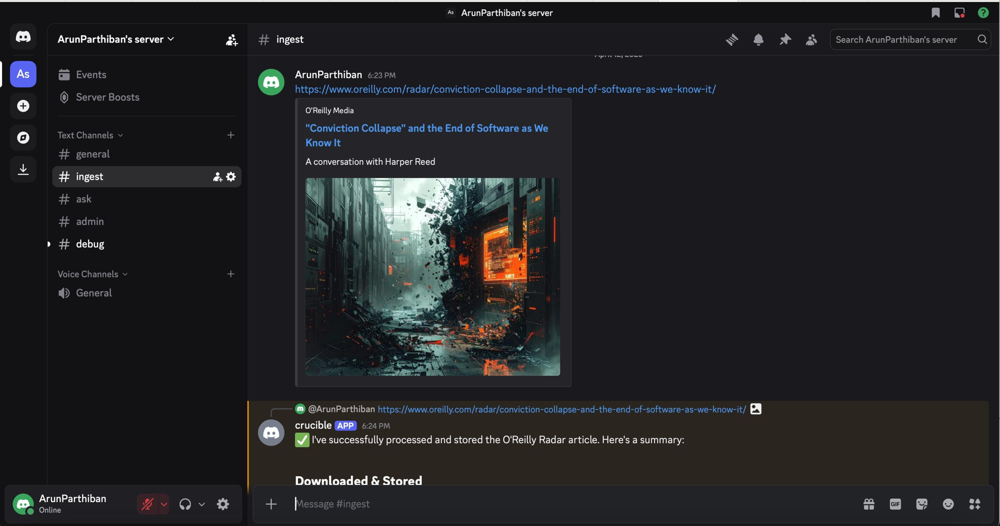
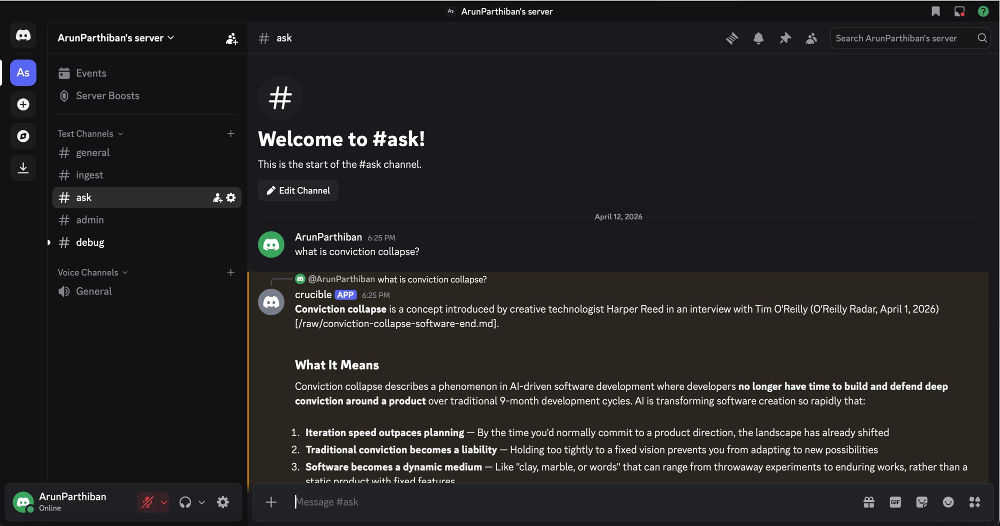

# Crucible. Building an Agentic Infrastructure Stack

Frontier models can write code, reason through multi-step problems, and orchestrate other agents. The infrastructure we give them either suppresses or unlocks their capabilities.

## The Mismanaged Geniuses Problem

Last week, [Alex Zhang](https://x.com/a1zhang), [Zed Li](https://x.com/zli11010), and [Omar Khattab](https://x.com/lateinteraction) published what they call the ["Mismanaged Geniuses" hypothesis](https://x.com/a1zhang/status/2042588627260018751). The core claim is that existing language models are severely underutilized because we're bad at decomposing tasks for them. The next leap in capabilities won't come from scaling models further. It'll come from enabling models to manage themselves.

The evidence is already showing up in products. Look at Claude Code's evolution over the last several months. First came a simple to-do list where the agent tracks its own tasks and checks them off. Then subagents. Then task tools. Then loops, cron, and monitors. Each addition gave the agent more control over its own execution, making it more capable by enabling it to decompose and manage work it previously had to do in a single pass.

Anthropic took this further with the launch of Claude Managed Agents last week. The entire product is behind an API. You create environments, define agents, start sessions, and trigger tool calls through REST endpoints. There's also a CLI. All of it is designed to be agent-friendly. These aren't interfaces for humans clicking buttons, they're interfaces for agents calling other agents.

Managed Agents also supports [multi-agent sessions](https://platform.claude.com/docs/en/managed-agents/multi-agent) where an agent spins up other agents to handle subtasks, enabling recursive task decomposition where each sub-agent runs in its own thread with isolated context.

## From Managed Agents to Crucible

Managed Agents is built for Claude, running on Anthropic's infrastructure. The primitives to build something like it in an LLM-agnostic way already exist. Sandbox environments from Modal or E2B, frontier models behind standard APIs. The missing piece is a control plane, a system of record that governs agent state, enforces lifecycle rules, and provides a durable event log. Crucible takes the same conceptual shape as Managed Agents (agents, environments, sessions, events), built on Kimi K2.5 Turbo hosted on [Fireworks AI](https://fireworks.ai/) with [Modal](https://modal.com/) providing the sandbox infrastructure.

Crucible has two layers.

```
                          ┌──────────────────────┐
                          │    User Interface    │
                          │  (Discord, CLI, API) │
                          └──────────┬───────────┘
                                     │
                 ┌───────────────────┼────────────────────┐
                 │          EXECUTION LAYER               │
                 │                                        │
                 │   ┌──────────────────────────────┐     │
                 │   │        Tool Router           │     │
                 │   │  polls events, drives turns  │     │
                 │   └───────┬──────────────┬───────┘     │
                 │           │              │             │
                 │     ┌─────▼─────┐  ┌─────▼──────┐      │
                 │     │    LLM    │  │  Sandbox   │      │
                 │     │ Fireworks │  │   Modal    │      │
                 │     │  K2.5     │  │  bash,read │      │
                 │     │  Turbo    │  │  write,edit│      │
                 │     └───────────┘  └────────────┘      │
                 │                                        │
                 └───────────────────┬────────────────────┘
                                     │
                              session events
                                     │
                 ┌───────────────────┼────────────────────┐
                 │          CONTROL LAYER (Temper)        │
                 │                                        │
                 │  ┌────────────┐  ┌──────────────────┐  │
                 │  │   State    │  │   Event Log      │  │
                 │  │  Machines  │  │  (append-only)   │  │
                 │  └────────────┘  └──────────────────┘  │
                 │  ┌────────────┐  ┌──────────────────┐  │
                 │  │   Cedar    │  │  Verification    │  │
                 │  │  Policies  │  │  Cascade (SMT)   │  │
                 │  └────────────┘  └──────────────────┘  │
                 │                                        │
                 │  Agents · Environments · Sessions      │
                 │                                        │
                 └────────────────────────────────────────┘
```

**The control layer, [Temper](https://github.com/nerdsane/temper).** Temper is [Sesh Nalla's](https://www.linkedin.com/in/seshendranalla/) actor-based runtime with an entity-relationship layer inspired by OData. Every agent, environment, session, and event is modeled as a governed entity with a declared state machine. You write a spec that defines the legal states and transitions for each entity. For example, a session spec declares that when an agent is processing a message, it must not accept new user messages unless interrupted. Temper verifies these specs symbolically at build time using SMT solving, so violations are caught before anything runs. At runtime, every action flows through Cedar authorization policies and gets recorded in an append-only event log.

**The execution layer, LLM + Tool Router.** The execution layer combines the language model with a tool router that polls Crucible for new session events. When a user sends a message, the router picks it up, calls out to the LLM, and appends the response as new events. If tool calls are needed (run a bash command, read a file, fetch a URL) the router executes them in a Modal sandbox and appends those results back to the session. The LLM reasons. The router acts. Temper records.

The session event log is the contract between these two layers. The control layer doesn't know or care which model is reasoning. The execution layer doesn't manage state. They communicate through events. [Anthropic describes](https://www.anthropic.com/engineering/managed-agents) this as separating the "brain" from the "hands." In [Schrödinger's Sandbox](https://open.substack.com/pub/arunparthiban/p/schrodingers-sandbox), I argued that the tool execution boundary is an implementation detail, not an architectural one. The same agent should be able to run tools locally or in a remote sandbox without changing its reasoning. Crucible is that argument turned into code. The session event log is the seam. The control layer doesn't know where tools execute. The execution layer doesn't manage state.

## What Crucible Looks Like

Crucible shares the conceptual shape of Anthropic's Managed Agents (agents, environments, sessions, events) but runs on your infrastructure. Temper exposes a Python REPL, built on Pydantic's [Monty](https://github.com/pydantic/monty), that lets you create and operate entities directly. Here's how you use it.

**Create an environment**

```python
env = await temper.create('Environment', {
    'Name': 'sandbox',
    'ConfigType': 'Modal',
    'NetworkingType': 'Unrestricted',
    'ModalImage': 'python:3.12-slim',
    'ModalTimeout': 300
})
```

**Create an agent**

```python
agent = await temper.create('ManagedAgent', {
    'Name': 'assistant',
    'System': 'You are a helpful coding assistant.',
    'ModelId': 'accounts/fireworks/routers/kimi-k2p5-turbo'
})
```

**Start a session**

```python
session = await temper.create('Session', {
    'AgentId': agent['entity_id'],
    'EnvironmentId': env['entity_id']
})
```

**Drive the agent loop**

```bash
crucible-chat send <session-id> "What files are in the current directory?"
crucible-chat respond <session-id>
# Agent uses bash tool, lists files, responds with findings
```

Sessions follow a governed lifecycle (`Rescheduling → Running → Idle → Terminated → Archived`) enforced by Temper's state machine, not arbitrary status fields.

For multi-agent orchestration, you define a delegation graph.

```python
await temper.create('CallableAgent', {
    'AgentId': coordinator['entity_id'],
    'CalleeAgentId': reviewer['entity_id']
})
```

The coordinator can delegate tasks to sub-agents, each running in an isolated thread with its own system prompt and model. The full delegation trajectory is captured in the event feed.

Agents have access to six built-in tools. Bash, read, write, edit, glob, and grep. Execution is routed to either the local host or a cloud sandbox depending on the environment configuration.

For scheduled work, you attach a cron schedule to a session.

```python
await temper.create('SessionSchedule', {
    'SessionId': session['entity_id'],
    'CronExpression': '*/5 * * * *',
    'MessageTemplate': 'Run a lint check on the knowledge base.',
    'MaxRuns': 100
})
```

Each tick posts a `user.message` to the session and the agent loop picks it up like any other turn.

## Crucible in Action

Andrej Karpathy recently [described](https://x.com/kaboratron/status/1911489830334210161) using Claude to build a personal knowledge base from his bookmarks — feed it links, have it summarize and organize the content, then query it later. It's the kind of task that sounds simple until you realize the agent needs to open arbitrary URLs in a sandbox, extract and summarize content through an LLM, store it durably, and retrieve it for Q&A. That's four infrastructure concerns for what should be one workflow.

To show what Crucible does with exactly this problem, I wired it up to a Discord bot with three channels. **ingest**, **ask**, and **admin**.

Drop a link in the **ingest** channel, and the agent opens it in an isolated Modal sandbox (because you don't open arbitrary URLs on your host), summarizes the content, and stores it in a knowledge base.

Ask a question in the **ask** channel, and the agent retrieves from the knowledge base and answers.

That's it. API-driven agents, sandboxed execution, stateful knowledge management, all stitched together on top of Crucible's primitives.






The new stack is a simple user interface, a set of primitives for constructing agents, a sandbox, and an LLM. The interface gives humans a way in. The primitives give agents structure — state machines, event logs, lifecycle rules. The sandbox and tools gives them hands. The LLM gives them a brain. The models are ready. The infrastructure is catching up.

---

*Crucible is open source and built on [Temper](https://github.com/nerdsane/temper). You can find the code at [github.com/ArunParthiban10/temper](https://github.com/ArunParthiban10/temper).*
