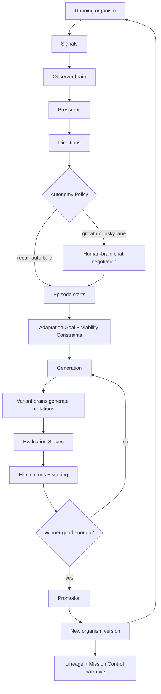

# RFC-0001: Directed Evolution

- Status: Draft
- Date: 2026-05-26
- Authors: Codex, with product direction from the human director
- Related:
  - ADR-0013: Evolution Loop Agent Integration
  - ADR-0025: Evolution Records & Governance Decisions as System Entities
  - ADR-0034: GEPA-Based Self-Improvement Loop
  - ADR-0035: IntentDiscovery Evolution Loop
  - `os-apps/evolution/`
  - `os-apps/intent-discovery/`

## Summary

Directed Evolution is Temper's end-to-end loop for improving a running
application as if it were an organism under guided selection pressure.

The loop starts from real signals: user behavior, simulated user behavior,
errors, traces, logs, metrics, unmet intents, and holistic observations made by
an agent brain. The brain interprets those signals into possible directions.
Some directions are safe enough to proceed automatically, especially repair
work. Growth directions, product changes, UX changes, and policy changes are
presented to the human director, who decides what should be pursued and
negotiates the Adaptation Goal and Viability Constraints with the brain in
chat.

Once an episode starts, background Codex agents generate variants, evaluate
them through explicit evaluation stages, eliminate weak variants with recorded
evidence, run surviving variants against AI simulated users, and promote the
winner as the new parent of the organism. Mission Control is the observational
surface for this process: it shows what is happening, why it is happening, what
is automated, how variants are being selected or eliminated, and how the
organism's lineage changes over time.

The v1 target is not a demo, a mock state machine, or a static specification
exercise. It must run a real evolution cycle against the Agent Answers organism,
using real Codex brains, real app variants, real evidence, real observability,
and a visible promotion in Genesis/Temper.

## Why This RFC Exists

The Codex and Claude directed-evolution branches explored useful pieces, but
neither completed the full product:

- Claude moved closer to a reusable engine shape: explicit evolution entities,
  WASM integration points, and a mission-control style UI with progress and
  elimination affordances.
- Codex moved closer to concrete worker execution and proof discipline:
  evidence-gated orchestration, local smoke tests, and working UI surfaces.

The missing center is the product contract. We need one document that explains
what Directed Evolution is supposed to do, where the brain is used, where WASM
or state machines are used, what the human sees, what the entities mean, and
what counts as "fully working."

## What We Take From Prior Branches

From the Claude track, keep:

- the Mission Control direction: progress, bracket-like variant flow,
  elimination visibility, and a dashboard that makes evolution feel alive
- the instinct that Directed Evolution needs reusable engine entities, not only
  one-off scripts
- the use of WASM integration points for bounded computation and reusable tools

From the Codex track, keep:

- the local worker direction for running Codex jobs outside deployed Genesis
- evidence-gated orchestration, where work is not considered done without
  persisted proof
- the concrete app-oriented proof instinct: a runnable organism, variants, and
  smoke/e2e verification instead of only specifications

Do not copy either track wholesale. Claude was closer to the reusable engine
shape. Codex was closer to concrete execution proof. The target system needs
both.

## Product Principles

1. The brain is real.
   Agent reasoning is not a decorative label on top of scripted logic. Where
   the system needs judgment, interpretation, product taste, diagnosis, or
   code generation, it must use an agent brain.

2. The organism is real.
   The thing being evolved is a running app, not only a set of abstract specs.
   For v1, the organism is the Agent Answers app.

3. Signals are not conclusions.
   A failed action, error spike, or deterministic unmet-intent capture is raw
   evidence. A brain interprets raw signals into pressures and directions.

4. Humans direct; they do not micromanage.
   The human chooses important growth directions, negotiates what matters, and
   sets or pins constraints. The human should not manually choose winners when
   the agreed selection process has enough evidence to decide.

5. Mission Control is mostly observational.
   The UI should make the living process legible. Chat remains the place where
   human-brain negotiation happens.

6. Automation must be visible.
   The UI must show which repair and growth pressures are allowed to proceed
   without human approval, and which require the human director.

7. Every elimination must explain itself.
   A dead variant should have a readable cause, linked evidence, and the
   relevant metrics or constraints that killed it.

8. Lineage matters.
   The human should see the organism changing over time, not only the current
   episode.

## Glossary

| Term | Meaning |
|------|---------|
| Organism | The app lineage being evolved. For v1, Agent Answers. |
| Organism Version | A promoted version of the organism that can be a parent for later episodes. |
| Lineage | The history of organism versions, promotions, branches, and mutations. |
| Signal | A raw observation from telemetry, traces, logs, failures, user behavior, simulated user behavior, or agent observation. |
| Pressure | A brain-interpreted reason the organism may need to change. Common classes are repair pressure and growth pressure. |
| Direction | A possible path for evolution, framed by the brain from one or more pressures. |
| Episode | One concrete evolution run pursuing a direction against an organism parent. |
| Generation | One round of variants inside an episode. An episode may have multiple generations. |
| Variant | One candidate app version produced during a generation. |
| Mutation | The concrete change introduced by a variant. |
| Adaptation Goal | The thing the episode is trying to improve. This replaces "North Star." |
| Viability Constraint | A requirement the organism must preserve while adapting. This replaces "Guardrail." |
| Selection Pressure | Episode-specific criteria used to decide which variants survive or win. |
| Evaluation Stage | A concrete trial, check, benchmark, review, or live test applied to variants. This replaces "Assay." |
| Stage Result | The result of one Evaluation Stage for one variant. |
| Metric | A named measurable quantity. |
| Measurement | One observed value for a Metric. |
| Elimination Rule | A hard rule that kills a variant. |
| Scoring Rule | A soft rule that ranks surviving variants. |
| Evidence | Trace, log, screenshot, diff, recording, test output, metric sample, or agent report supporting a result. |
| Trial | A live or simulated use of a variant, usually by AI simulated users. |
| Promotion | The act of making a winning variant the new parent organism version. |
| Autonomy Policy | The policy that says which pressures and episodes can proceed without human approval. |
| Brain Run | One invocation or session of an agent brain doing a bounded task. |

## End-to-End Flow

### 1. Signals

Signals can come from deterministic systems or from brains.

Deterministic signal sources include:

- errors
- latency regressions
- failed actions
- unavailable entity sets or actions
- failed guards
- test failures
- trace or log anomalies
- Datadog monitor alerts
- deterministic unmet-intent capture already present in Temper

Brain-observed signal sources include:

- a simulated user agent struggling to complete a goal
- a background observer noticing repeated friction that does not appear as a
  clean error
- correlation across user sessions, traces, logs, and app state
- product opportunities inferred from actual usage
- confusing UX patterns discovered through agent use

Signals are stored and tagged. They do not directly become directions.

### 2. Pressures

The observer brain reads signals and produces pressures. A pressure is a
reason to consider changing the organism.

Pressure classes:

| Class | Meaning | Default autonomy |
|-------|---------|------------------|
| Repair Pressure | Something is broken, degraded, failing, or unsafe. | May auto-start and auto-promote when bounded. |
| Growth Pressure | The organism could become more capable or useful. | Human approval required by default. |
| UX Pressure | The app works but human or agent users struggle with flow, clarity, or ergonomics. | Human approval required. |
| Policy Pressure | Behavior may need governance, permissions, or safety changes. | Human approval required. |
| Data Pressure | Schema, retention, indexing, or data movement may need to change. | Human approval required unless explicitly classified as bounded repair. |

### 3. Directions

A direction is a brain-framed possible path for evolution. It must include:

- source pressures
- source signals and evidence
- why the brain thinks this is real
- why it matters to the organism
- whether it is repair, growth, UX, policy, data, or mixed
- recommended autonomy lane
- expected user-visible effect
- expected risks
- initial Adaptation Goal proposal
- initial Viability Constraint proposal

Mission Control should show directions as a queue, but not as vague cards.
The human must be able to click through and inspect what fed each direction,
why it exists, and what evidence supports it.

### 4. Autonomy Routing

Autonomy Policy determines whether a direction can proceed automatically.

Default lanes:

| Lane | Can start without human? | Can promote without human? | Examples |
|------|---------------------------|-----------------------------|----------|
| Bounded Repair | Yes | Yes, if all Viability Constraints pass and blast radius is bounded. | Fix broken action, restore failing integration, revert performance regression. |
| Supervised Repair | Yes | No, unless the human has pre-authorized this class. | Data migration repair, risky dependency change. |
| Directed Growth | No | Yes, after the human-approved episode contract passes. There is no manual winner override. | New product feature, new workflow, new capability. |
| UX Change | No | No, unless explicitly pre-authorized. | Layout or interaction changes. |
| Policy Change | No | No. | Permissions, approval rules, data access rules. |

The UI must always show:

- active autonomy lane
- why the lane was chosen
- what the system may do without human input
- what is blocked until human input
- how the human can ask the brain to adjust policy in chat

### 5. Human-Brain Negotiation

For growth, UX, policy, and other ambiguous directions, the human and the brain
negotiate in chat. The chat is outside Mission Control. In v1, this means this
Codex session.

The output of that negotiation is not merely prose. The brain must materialize:

- Adaptation Goal
- Viability Constraints
- Selection Pressure
- Evaluation Stages
- Elimination Rules
- Scoring Rules
- required evidence
- any pinned constraints from the human

Mission Control reflects those artifacts once they exist, but it does not try
to replace the conversation.

### 6. Episode Start

An episode starts from:

- one selected direction
- one parent organism version
- one Adaptation Goal
- one set of Viability Constraints
- one Selection Pressure
- one Autonomy Policy lane
- one initial Evaluation Plan

An episode is not the same as a direction. A direction can lead to multiple
episodes over time. An episode can have multiple generations.

### 7. Generations and Variants

Each generation creates multiple variants from the current episode parent.

For v1:

- background Codex jobs generate the variants
- each variant gets its own branch, app ref, deployment slot, or isolated
  runtime identity
- each variant records its mutation summary
- each variant records the Brain Run that created it
- no variant may modify its own evaluators, Evaluation Stages, Elimination
  Rules, Scoring Rules, or Viability Constraints

If no variant is good enough, the episode may start another generation. The
next generation may use the best survivor, the original parent, or a deliberate
crossover/refinement source, but that choice must be recorded.

### 8. Evaluation Stages

Evaluation Stages are the legible checkpoints where variants are tested,
trialed, reviewed, eliminated, or scored.

Common stages:

| Stage | Purpose | Typical executor |
|-------|---------|------------------|
| Build Stage | Does the variant compile, install, and start? | Script/tooling, recorded as evidence. |
| Spec Verification Stage | Do affected IOA/CSDL/Cedar artifacts pass required verification? | Temper verification cascade. |
| Static Review Stage | Does the change violate obvious code, safety, determinism, or policy constraints? | Codex review brain plus deterministic checks. |
| Behavioral Stage | Does the variant satisfy the Adaptation Goal in controlled trials? | AI simulated users plus app telemetry. |
| Viability Stage | Does the variant preserve required existing behavior? | Tests, traces, simulated users, metrics. |
| Observability Stage | Does the variant emit required traces, logs, and metrics? | Tooling plus Datadog evidence. |
| Production Trial Stage | Does the variant perform under live or production-like traffic? | AI simulated users, routed traffic, Datadog. |
| Selection Stage | Which surviving variant best satisfies the Selection Pressure? | Selector brain plus scoring rules. |

Stages can be reused across episodes, but they are not fully universal. The
organism should have a baseline evaluation ladder, and each episode may add
episode-specific stages, metrics, and rules.

### 9. Metrics, Measurements, and Rules

Metrics are reusable definitions. Measurements are values observed during a
stage.

Metric examples:

- task success rate
- unmet-intent rate
- failed action rate
- latency p50/p95/p99
- error rate
- trace span failure count
- cost per successful task
- number of user-agent retries
- human-readable confusion score from simulated users
- regression count against preserved workflows
- code review severity count
- verification pass/fail
- deployment health

Elimination Rules kill variants. Examples:

- build fails
- verification fails
- required observability is missing
- task success rate is below the parent
- any pinned Viability Constraint is violated
- security or policy review finds a blocking issue
- p95 latency exceeds the allowed regression budget

Scoring Rules rank survivors. Examples:

- maximize task success rate
- minimize unmet-intent rate
- minimize added complexity
- minimize latency and cost
- prefer smaller mutation when outcomes are equivalent
- prefer clearer user-facing behavior when metrics are close

Every Elimination Rule and Scoring Rule must name the metrics, evidence, and
stage results it depends on.

### 10. Trials and AI Simulated Users

The organism is used by traffic. In v1, this traffic includes AI simulated
users. These users must be agents, not scripts pretending to be users.

AI simulated users:

- receive realistic goals
- interact with the running app
- make their own decisions about how to proceed
- produce traces and narrative observations
- can fail, misunderstand, retry, or reveal unmet intent
- are not told which variant should win
- are tagged in observability with `simulated_user_id`

The simulation harness may provide task setup, accounts, seeded data, and
routing. The user behavior itself should come from agent reasoning.

### 11. Selection and Promotion

Selection chooses the best surviving variant according to the agreed Selection
Pressure, Evaluation Stage results, Elimination Rules, Scoring Rules, and
evidence.

The selector can be a brain, but it must be constrained by the recorded
selection artifacts. It should explain its conclusion in human-readable terms.

The human does not manually override the winner in the normal flow. If the
human disagrees with a winner, that means the Adaptation Goal, Viability
Constraints, Selection Pressure, or Evaluation Stages were wrong or incomplete.
The right action is to stop, revise, or run another episode, not silently pick
a favorite.

Promotion makes the winner the new parent organism version and records:

- parent version
- winning variant
- mutation summary
- selection explanation
- evidence bundle
- deployment/app ref
- rollback pointer
- lineage edge

## Brain Roles

The system uses multiple brain instances. They are the same class of agent
where possible, but they are not the same session.

| Role | Responsibility | v1 engine |
|------|----------------|-----------|
| Human-facing director brain | Negotiate goals, constraints, and direction with the human. | This Codex chat session. |
| Observer brain | Read signals and infer pressures/directions. | Background Codex via TemperPaw worker. |
| Direction framer brain | Produce direction records with provenance and recommended autonomy lane. | Background Codex via TemperPaw worker. |
| Evaluation designer brain | Propose Adaptation Goal, Viability Constraints, Selection Pressure, stages, metrics, and rules. | This Codex chat for human-facing negotiation; background Codex for draft materialization. |
| Variant generator brain | Produce candidate app variants. | Background Codex jobs via TemperPaw worker. |
| Simulated user brain | Use the organism like a real user with a goal. | Background Codex jobs or another approved agent runner, managed through TemperPaw. |
| Reviewer brain | Review variants for code, UX, determinism, safety, or policy issues. | Background Codex jobs. |
| Selector brain | Explain the winner from recorded evidence and scoring. | Background Codex constrained by stage results. |
| Narrator brain | Produce concise human-readable episode and lineage explanations for Mission Control. | Background Codex. |

TemperPaw is not the brain. TemperPaw is the worker/orchestration layer that can
run local Codex jobs, feed them bounded context, capture outputs, and write
results back to Temper/Genesis.

## Architecture

Directed Evolution has three planes.

### Control Plane

The Control Plane stores the state machine and audit trail:

- Organisms
- Directions
- Episodes
- Generations
- Variants
- Evaluation Stages
- Stage Results
- Trials
- Promotions
- Lineage
- Autonomy Policy
- Brain Runs
- Work Items

This should be Temper-native: IOA entities, OData APIs, Cedar governance,
telemetry, and event sourcing.

Existing `IntentDiscovery` and `EvolutionRun` are useful predecessors, but the
full Directed Evolution model is broader:

- `IntentDiscovery` maps most closely to signal gathering, observer brain
  analysis, and direction creation.
- `EvolutionRun` maps most closely to one episode/generation loop, but its
  current shape is GEPA/spec-mutation oriented and must be extended for app
  variants, AI simulated users, live trials, lineage, and Mission Control.

### Execution Plane

The Execution Plane performs work outside the state machine:

- local Codex jobs
- app variant generation
- build/test commands
- deployment/app-ref creation
- simulated user runs
- evidence collection

For v1, execution should be pull-based:

1. The Control Plane creates a Work Item.
2. A local TemperPaw worker polls or subscribes for runnable work.
3. The worker starts a Codex job locally.
4. The job produces structured output and artifacts.
5. The worker writes results back to the Control Plane.

This avoids requiring deployed Genesis or Railway services to directly run
Codex. The deployed system can own the entities and UI while local workers do
the agent execution.

### What Moves State

The state machine is moved by Temper entity actions, not by hidden UI state and
not by WASM acting on its own.

| Thing | Moves state? | Role |
|-------|--------------|------|
| Human chat | Indirectly | Human tells the director brain what to pursue or preserve. The brain materializes entity actions. |
| Mission Control UI | Sometimes | Operational clicks can dispatch explicit entity actions such as pause, resume, stop, dismiss, or pin. |
| Temper entities | Yes | The source of truth for Direction, Episode, Generation, Variant, StageResult, Trial, Promotion, and Lineage transitions. |
| TemperPaw worker | Yes, through OData/entity actions | Pulls Work Items, runs Codex jobs, then records results back into Temper/Genesis. |
| Codex brain | Indirectly | Decides, generates, reviews, selects, or explains, then emits structured outputs that workers submit as actions. |
| WASM modules | No direct authority | Compute bounded results, transform data, call allowed tools, or produce reports. Their outputs must be recorded through entity actions. |
| Datadog | No | Provides evidence through telemetry. It does not decide or transition entities. |

This separation is important: brains make judgments, WASM computes bounded
steps, workers execute jobs, and Temper entities preserve the official state
history.

### Observability Plane

The Observability Plane provides evidence:

- traces
- logs
- metrics
- screenshots
- test output
- deployment health
- simulated user trajectories
- app-level events

Datadog can be used even when Codex runs locally because local and deployed
processes can emit to the same observability backend. All emitted data must
carry correlation tags:

- `organism_id`
- `organism_version_id`
- `direction_id`
- `episode_id`
- `generation_id`
- `variant_id`
- `trial_id`
- `brain_run_id`
- `simulated_user_id`
- `tenant`
- `app_ref`
- `environment`

The UI must never depend on only opaque Datadog links. Datadog is source
evidence, but key results should be materialized into Temper entities so the
episode can be understood later.

## Entity Plan

The exact IOA specs can evolve, but the model should include these first-class
entities or equivalent records.

| Entity | Purpose |
|--------|---------|
| Organism | Identifies the app being evolved and its baseline evaluation ladder. |
| OrganismVersion | A promoted parent version with app refs, deployment refs, and evidence. |
| LineageEdge | Connects parent versions, variants, promotions, and mutation summaries. |
| Signal | Raw observation with source, timestamp, tags, and evidence references. |
| Pressure | Brain-interpreted reason to consider evolution. |
| Direction | Candidate path for evolution with provenance, risk, autonomy lane, and proposed goal. |
| Episode | Concrete run pursuing one direction from one parent version. |
| Generation | One variant batch inside an episode. |
| Variant | Candidate app version with mutation, branch/ref, runtime identity, and status. |
| Mutation | Structured summary of what a variant changed. |
| AdaptationGoal | Episode goal the variants are trying to satisfy. |
| ViabilityConstraint | Durable or episode-specific behavior that must be preserved. |
| SelectionPressure | Episode-specific criteria for survivor ranking and winner selection. |
| EvaluationStage | Reusable or episode-specific checkpoint applied to variants. |
| StageResult | Result of a stage for a variant. |
| MetricDefinition | Reusable metric definition. |
| Measurement | Observed metric value tied to a StageResult or Trial. |
| EliminationRule | Hard rule that can kill a variant. |
| ScoringRule | Soft rule that ranks survivors. |
| EvidenceArtifact | Trace, log, screenshot, report, diff, or artifact supporting a result. |
| Trial | Live or simulated traffic run against a variant. |
| Promotion | Winning variant becoming the new organism parent. |
| AutonomyPolicy | Which pressure classes and risks can start or promote automatically. |
| BrainRun | One bounded invocation of a brain role. |
| WorkItem | Runnable unit consumed by TemperPaw or another worker. |

## Mission Control UX

Mission Control should follow Claude's stronger UI direction: a live,
game-dashboard-like surface showing progress, brackets, eliminations, evidence,
and lineage. It should be useful, not theatrical.

Primary views:

| View | Purpose |
|------|---------|
| Direction Queue | Shows possible directions, pressure class, autonomy lane, and provenance. |
| Direction Detail | Explains what fed the direction, why it exists, evidence, and proposed goal. |
| Episode Dashboard | Shows current stage, generation, variants, survival status, and progress. |
| Variant Bracket | Shows variants moving through stages, eliminations, and winner selection. |
| Variant Compare | Compares mutations, metrics, evidence, and constraints across variants. |
| Death Report | Explains why a variant died, with evidence and violated rules. |
| Trial Monitor | Shows AI simulated users, goals, traces, and outcomes per variant. |
| Autonomy Panel | Shows what is currently allowed to proceed automatically. |
| Lineage View | Shows the organism's growth over versions, branches, promotions, and mutations. |
| Specimen View | Shows the current organism and how recent episodes changed it. |

Allowed UI interactions in v1:

- pause, resume, or stop an episode
- inspect why a variant died
- compare variants
- pin an important Viability Constraint
- dismiss a direction
- optionally select a direction only if that creates a real work item/callback
  for the brain and makes clear that chat negotiation may still be required

Not in v1 UI:

- approve or revise evaluation criteria in forms
- ask the brain from inside the UI
- manually promote a winner
- pretend that a click replaces human-brain negotiation

## Relationship Between Chat and UI

Chat is the collaboration surface. Mission Control is the observation surface.

The human should be able to say in chat:

- pursue this direction
- explain this direction
- change the Adaptation Goal
- pin this constraint
- stop this episode
- why did this variant die
- what changed in the organism

The UI should update because the underlying entities changed, not because the
UI is a separate command surface with its own hidden workflow.

If a UI action requires back-and-forth human judgment, it should be done in
chat instead. If a UI action is low-ambiguity and operational, it can live in
Mission Control.

## V1 Vertical Slice

The first fully working slice should prove the whole loop on one organism.

Organism:

- Agent Answers app

Brains:

- this Codex chat as human-facing director brain
- background Codex jobs via TemperPaw for observer, variant generation,
  simulated users, review, selection, and narration

Control Plane:

- Temper/Genesis entities for organism, direction, episode, generation,
  variant, stage result, trial, promotion, lineage, and autonomy policy

Execution Plane:

- local TemperPaw worker launches Codex jobs
- variants are created as real app refs, branches, deployment slots, or
  otherwise isolated runnable versions

Observability:

- Datadog receives traces/logs/metrics from the app, variants, simulated users,
  and workers
- key evidence is materialized into Temper entities

Required flow:

1. Agent Answers is running as the parent organism.
2. AI simulated users use the app for realistic goals.
3. Signals are captured from app behavior, user-agent behavior, errors, traces,
   logs, and metrics.
4. Observer brain produces pressures and directions.
5. Mission Control shows directions with provenance.
6. Human selects or confirms a growth direction in chat.
7. Human and Codex negotiate Adaptation Goal and Viability Constraints in chat.
8. Episode starts from the selected direction.
9. Background Codex jobs generate at least three variants.
10. Each variant runs through Evaluation Stages with recorded Stage Results.
11. AI simulated users exercise surviving variants.
12. Weak variants are eliminated with Death Reports.
13. Selector brain chooses the winner from evidence and scoring.
14. Repair episodes may auto-promote if policy allows; growth episodes promote
    after the human-approved direction and evaluation contract completes.
15. Winner becomes the new Organism Version.
16. Mission Control shows what changed and why it won.
17. Lineage View shows the organism's new branch/version.
18. The promoted app behavior is visible in Genesis/Temper, not only in docs.

## Acceptance Criteria

Directed Evolution v1 is fully working when all of the following are true:

- A real Agent Answers organism is registered with a parent version.
- AI simulated users, not deterministic scripts, exercise the organism.
- Signals from usage and observability are captured with correlation IDs.
- A background observer brain creates at least one direction from real signals.
- The direction shows provenance in Mission Control.
- The human can negotiate the Adaptation Goal and Viability Constraints with
  Codex in chat.
- The negotiated artifacts are persisted as entities.
- An episode creates multiple real variants.
- Variants are actually runnable.
- Evaluation Stages execute and produce Stage Results, Metrics, Measurements,
  and Evidence Artifacts.
- At least one variant is eliminated with an inspectable Death Report.
- Surviving variants are trialed with AI simulated users.
- The selector brain chooses a winner from recorded evidence.
- The winner is promoted to a new Organism Version.
- Lineage records the parent, winner, mutation, and promotion evidence.
- Mission Control displays directions, episode progress, variant comparison,
  eliminations, autonomy policy, and lineage.
- Datadog contains correlated traces/logs/metrics for the episode.
- The final promoted change is visible in the running app.
- No stage is mocked in a way that could pass without real execution.

## Open Questions

1. Should the Control Plane live first in deployed Genesis/Temper, local
   Temper, or a hybrid where local Temper mirrors deployed entities?
2. What is the first growth direction for Agent Answers that is meaningful but
   small enough for a v1 proof?
3. How should app variants be isolated: branches, app refs, deployments,
   tenant-scoped routing, or another Genesis primitive?
4. What is the minimal Datadog setup for local worker plus deployed app
   correlation?
5. Which parts of the current `os-apps/evolution/EvolutionRun` should be kept,
   renamed, or split into Episode/Generation/Variant entities?
6. Does `IntentDiscovery` become the observer/direction creator, or does
   Directed Evolution introduce a broader `DirectionDiscovery` entity?
7. What policy language should express bounded growth lanes if the human
   pre-authorizes some growth classes later?
8. How should rollback be represented in lineage and Promotion records?

## Implementation Notes

- Do not hand-write organism-specific specs as the primary workflow. The human
  describes intent in chat; the brain materializes entities and changes.
- Do not let variant-generation brains modify evaluators, Selection Pressure,
  Elimination Rules, Scoring Rules, or Viability Constraints for their own
  variants.
- Keep deterministic checks and WASM computation where they are useful, but do
  not replace agent judgment with scripts when the product requires a brain.
- Keep Mission Control sparse in interaction and rich in explanation.
- Prefer Temper entities over markdown progress files for stateful work when
  Temper MCP is available.
- Preserve the existing verification cascade and Cedar governance model.

## Non-Goals

- Building a generic no-code evolution designer before proving one organism.
- Replacing chat with an in-app assistant.
- Letting the human manually select winners.
- Treating failed deterministic actions as final unmet-intent conclusions
  without brain interpretation.
- Running Codex inside a deployed Railway/Genesis process for v1.
- Shipping a dashboard backed by fixture data and calling it complete.

## Naming Decisions

Accepted terms:

- Adaptation Goal
- Viability Constraint
- Selection Pressure
- Evaluation Stage
- Stage Result
- Direction
- Episode
- Generation
- Variant
- Mutation
- Trial
- Promotion
- Lineage
- Autonomy Policy

Rejected or avoided terms:

- Fitness Charter
- Fitness Plan
- Assay
- Human winner override

The word "fitness" may still be used informally or in code where it is already
established, but user-facing v1 language should prefer Selection Pressure,
Evaluation Stage, Metrics, Elimination Rules, and Scoring Rules.
